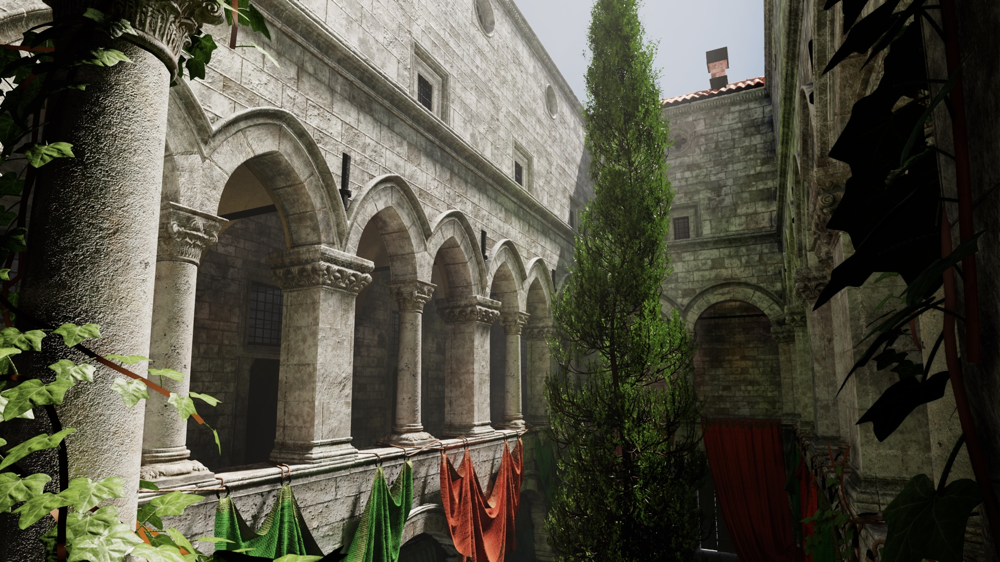

# Blix

**Blix is a readable native game engine for C# / .NET that you use as a library, not a framework — game code wires explicit rendering, asset, audio, physics, and runtime primitives into each frame, instead of handing control to an engine that owns the loop.**

An in-development engine workbench: rendering, assets, streaming, audio, physics, UI, animation, runtime hosting, and diagnostics, all exposed as explicit pieces game code wires together directly. Blix doesn't try to make the engine disappear — it makes the important machinery visible.

The split is deliberate. The engine owns the reusable hard parts — cooked asset formats, background loading, progressive texture upload, mesh bundling, the typed graphics-command layer, shader interfaces, render graphs, Vulkan execution, and diagnostics. The game owns how those become a frame — which passes run, how draw groups are built, what gets culled, how LOD is chosen, how the world is represented. No single scene renderer or fixed world model is imposed on top, and there's no ECS, editor, scripting, or hot reload.

The stack is Vulkan-first: `Blix.Graphics` is the typed command layer, `Blix.Graphics.Vulkan` the backend, and `Blix.Runtime.Silk` hosts the window, input, Vulkan surface, audio device, and diagnostics. An application supplies its own interface (`IUiSource`), declares named views to draw and pick through, and gets shared shader compilation, shared arguments and bounded `--frames` runs from the host rather than restating them — `src/Blix.Demos.Chassis/` is that surface with nothing else attached. Visibility is part of that surface — systems contribute debug values, controls, timers, events, overlays, stats, selections, inspectors, and live-tunable parameters, so the engine can answer practical questions while it runs: what was loaded, streamed, bundled, submitted, culled, and drawn, and where the frame time went.

Today that spans cooked binary asset formats (`.blixtex`, `.blixprobe`, `.blixmesh`), progressive texture streaming, mesh bundling, screen-space-error LOD, GPU-driven indirect drawing, per-instance instanced rendering, PBR + HDR/IBL, cascaded and cubemap shadows, volumetric fog, bloom, tonemapping, glTF skinning, OpenAL positional audio, kinematic collision, and a Vulkan `SpriteBatch`/font path — driving four complete games (2D Pong, a 3D endless runner, a tank-arena survival shooter, and a tower defense) alongside the Sponza capabilities scene.

Blix is still early — APIs are changing, the demos do real engine work, and some systems are exposed before they're polished. The goal is a readable native engine you wire and own: serious enough to push multi-GB scenes through a modern Vulkan frame, small enough to understand and change.

## Documentation

- [`docs/architecture.md`](docs/architecture.md) — orientation: project graph, host contracts, the Vulkan binding model, conventions, where to find things.
- [`docs/renderer.md`](docs/renderer.md) — the Vulkan renderer: render graph, recording draws, pipelines, shaders, and the rendering techniques (PBR, IBL, shadows, bloom, fog).
- [`docs/blix.md`](docs/blix.md) — the layer game code targets: loop, scene primitives, cameras, lights, animation, skeletal, physics, geometry, audio, picking.
- [`docs/demos.md`](docs/demos.md) — full writeups for every demo (the table below is the index).

## Demos

Eleven demos ship in `src/`, all on the Vulkan backend, each a standalone entry point and an
executable spec for an engine subsystem. **Vulkan Sponza** is the capabilities demo — the
forward edge of what the engine can pull off, written up below. Full writeups for the rest
live in [`docs/demos.md`](docs/demos.md).

| Demo | Run | Proves |
| --- | --- | --- |
| **Vulkan Sponza** | `tools/run-vulkan-sponza.sh` | Capabilities edge — multi-GB cooked/streamed/SSE-LOD'd scene, 3-cascade shadows, HDR + 4× MSAA, GGX/IBL, volumetric fog |
| **Pong** | `tools/run-pong.sh` | Game · 2D — the `SpriteBatch` / `Font` + CRT post-FX path |
| **Runner** | `tools/run-runner.sh` | Game · 3D — per-instance instancing + skeletal animation |
| **Tank Arena** | `tools/run-tank.sh` | Game · 3D — `Transform3D` parenting (turret rig; detach-and-fly shells) |
| **Bulwark** | `tools/run-bulwark.sh` | Game · 3D — pointer picking + A\* nav + skinned-mesh instanced crowd |
| **Particles** | `tools/run-particles.sh` | VFX · `ParticleBatch` + fullscreen / `PostChain` post-process |
| **Instanced** | `tools/run-instanced.sh` | Reference · the per-instance instancing foundation |
| **Lit** | *(launcher — see docs)* | Reference · the lit / shadow / PBR / IBL / bloom path |
| **Graph** | `dotnet run --project src/Blix.Demos.VulkanGraph` | Reference · render-graph topology |
| **Hello** | `tools/run-vulkan-hello.sh` | Reference · the narrowest known-good Vulkan call site |
| **Chassis** | `tools/run-chassis.sh` | Reference · the application chassis — own UI without diagnostics, host-owned `--frames`, no shader boilerplate |

Four are complete, end-to-end playable games (Pong, Runner, Tank Arena, Bulwark); one is a
VFX showcase; five are focused references. (The OpenGL backend and its four heavy demos
were sunset; Pong was rebuilt on the Vulkan `SpriteBatch`.)

### Vulkan Sponza — capabilities demo



```sh
tools/run-vulkan-sponza.sh
```

The forward edge of the engine, and the demo where the whole pipeline has to come together to keep a multi-GB scene playable: the Khronos Intel Sponza scene (main + curtains + ivy + trees packs). It loads cooked siblings only (`.blixtex` BC7/BC5 textures, `.blixprobe` IBL, `.blixmesh` geometry with LOD): 3-cascade directional shadows with per-cascade resolution + rotated-Vogel PCF, depth pre-pass, R11G11B10F HDR scene target at 4× MSAA, GGX/IBL + Fresnel glass, ACES/AgX tonemap, and an optional froxel volumetric-fog compute pass (`--fog`). Geometry uses screen-space-error LOD over cook-time meshopt chains + spatial split, all bundled into one shared vertex/index buffer by the engine's `MeshBundler` (draws are sub-ranges), with cutout foliage rendered as depth-writing MASK + alpha-to-coverage to avoid overdraw. The Vulkan binding model (descriptor sets + std140 UBO layouts + push ranges) is reflected from the compiled SPIR-V at build time; cooked textures stream in through the engine's `GltfTextureLoader` + `AsyncLoadQueue`; and shader/scene tunables are live-editable in the overlay via `//@tune` / `[Tune]` decorators. The diagnostics overlay surfaces per-pass draw/triangle counts, the LOD histogram, and a CPU-phase frame breakdown (`cpu-wait` / `cpu-encode` / `cpu-submit`) for separating GPU-bound from draw-encode-bound frames — the levers you actually pull to make the scene fast.

Assets are multi-GB and not committed — run `tools/setup-sponza-modern.sh` once to populate + cook from a local Khronos download.

## Cooked asset pipeline

VulkanSponza runs entirely off cooked siblings; `tools/setup-sponza-modern.sh` populates the sources from a local Khronos download and produces the cooked split, and the cook scripts re-cook on demand. Source assets are multi-GB and not committed. Source: <https://github.com/KhronosGroup/glTF-Sample-Assets/tree/main/Models/IntelSponza>.

Three sibling binary formats let the runtime skip the slow paths (PNG decode, equirect → IBL convolution, glTF JSON+`.bin` parse + accessor walk). All cookers live in `src/Blix.Tools.Cook` (`blix-cook textures|probe|mesh`).

| Format | Cook input | What it skips at load | Code |
| --- | --- | --- | --- |
| `.blixtex` | PNG / JPEG | StbImage decode + mip generation; supports BC7/BC5 | `src/Blix.Graphics.Images/BlixTex.cs` |
| `.blixprobe` | HDR equirect | Equirect → cube + diffuse irradiance + GGX prefilter + BRDF LUT bake | `src/Blix.Graphics.Images/BlixProbe.cs` |
| `.blixmesh` | `.gltf` / `.glb` | SharpGLTF `.bin` validation + per-accessor walk + vertex packing; also bakes a meshopt LOD chain (+ optional spatial split) per primitive | `src/Blix.Assets/BlixMesh.cs` |

When a `.blixmesh` sibling exists, the importer also switches `ModelRoot.Load` to a lite path (`ReadContext.Create` + `ValidationMode.Skip` + an empty buffer reader) — the JSON still parses for material descriptors, but the multi-megabyte `.bin` validation is skipped entirely. Textures upload progressively through `ResourceUploader`, smallest mip first, so materials bind a usable-if-blurry texture within a frame and sharpen over the next few.

`.blixmesh` also carries geometry LOD: `blix-cook mesh` bakes a meshoptimizer-decimated chain per primitive (each level tagged with its world-space geometric error) and, with `--split N`, recursively splits oversized primitives into spatial chunks so a huge floor/wall/ivy mesh can coarsen its far half independently of its near half. The runtime picks a level by screen-space error; `src/Blix.Demos.VulkanSponza/` is the working reference.

## Build

```sh
dotnet build Blix.sln
```

Target framework: net8.0. The 2D physics CLI test harness lives at `src/Blix.Test.Physics2D` — run with `dotnet run --project src/Blix.Test.Physics2D/Blix.Test.Physics2D.csproj`.

## Platform notes

- **Launchers exec the apphost, never `dotnet run`.** Homebrew's `$prefix/bin/dotnet` is a `#!/bin/bash` wrapper and `/bin/bash` is SIP-protected, so dyld strips `DYLD_*` before the app starts and Silk reports "doesn't support Vulkan on this computer" while Vulkan is fine. Every `tools/run-*.sh` exports `DOTNET_ROOT`, builds, then `exec`s the apphost — copy one when adding another. `--frames N` works for any application; the host honours it.
- **Vulkan toolchain (one-time, macOS).** `brew install molten-vk vulkan-loader vulkan-headers vulkan-tools vulkan-validationlayers shaderc`. The `tools/run-*.sh` launchers point the loader at MoltenVK. `BLIX_VK_VALIDATE=1` enables Khronos validation layers; `BLIX_DIAG_INTERVAL=<frames>` controls the periodic console digest cadence (default 60; `BLIX_DIAG=off` disables).
- **macOS audio requires OpenAL Soft.** Apple's bundled `OpenAL.framework` has been deprecated since macOS 10.15 and silently no-ops on most source calls (looping, playback transitions). Install via `brew install openal-soft` — `OpenALAudioDevice` probes the standard Homebrew prefixes and points the loader at the working library.
- **Keep shaders ASCII.** Shaders are compiled offline to SPIR-V with `glslc` (Khronos), so the old Apple GL 4.1 compiler quirks no longer bite at runtime. Pure ASCII is still the portability convention for the shader library.
